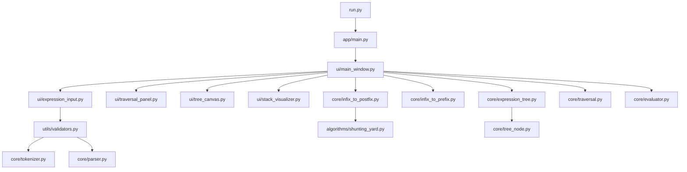

# 🌳 Expression Tree Visualizer


## Overview

Expression Tree Visualizer is an interactive Python desktop application for parsing infix expressions, converting them to prefix and postfix notation, building expression trees, and visualizing each stage of the workflow. It is designed for algorithm study, classroom demonstration, and hands-on exploration of how stacks and binary trees cooperate during expression processing.

Operands may be numeric values or symbolic variables, so expressions such as `(A+B)`, `x*(y+z)`, and `((a+4)/(b-2))` can be visualized and traversed alongside purely numeric expressions.

## Features

| Capability | Description |
|---|---|
| Expression tree visualization | Render the parsed expression as a binary tree with interactive navigation |
| Infix → postfix conversion | Convert infix expressions using the Shunting-Yard algorithm |
| Infix → prefix conversion | Generate prefix notation from the same token stream |
| Tree traversals | Explore inorder, preorder, and postorder traversals |
| Step-by-step algorithm visualization | Replay stack operations and tree-building stages |
| Symbolic expressions | Accept single-letter variables alongside numeric operands |
| Interactive GUI | Work through expressions in a desktop interface built with PySide6 |

## Demo Expressions

| Expression | Type | Prefix | Postfix | Evaluation |
|---|---|---|---|---|
| `((3+4)/(9-2))` | Numeric | `/ + 3 4 - 9 2` | `3 4 + 9 2 - /` | `1` |
| `(A+B)` | Symbolic | `+ A B` | `A B +` | Not available |
| `x*(y+z)` | Symbolic | `* x + y z` | `x y z + *` | Not available |
| `((a+4)/(b-2))` | Mixed symbolic | `/ + a 4 - b 2` | `a 4 + b 2 - /` | Not available |

## Architecture



## Installation

```bash
git clone <repo>
cd expression-tree-visualizer
pip install -r requirements.txt
python run.py
```

## Usage

1. Launch the application with `python run.py`.
2. Enter an infix expression such as `((3+4)/(9-2))` or `x*(y+z)`.
3. Choose **Build Expression Tree** for an immediate result or **Step-by-Step Animation** to replay the algorithm.
4. Inspect prefix and postfix conversions, then run inorder, preorder, or postorder traversal highlighting.
5. Review the evaluation panel for numeric expressions, or the symbolic evaluation notice for variable-based expressions.

## Algorithms Used

| Algorithm | Purpose |
|---|---|
| Shunting-Yard | Convert infix notation to postfix |
| Reverse-then-convert prefix generation | Produce prefix notation from infix input |
| Stack-based tree construction | Build a binary expression tree from postfix tokens |
| Depth-first traversals | Generate inorder, preorder, and postorder sequences |
| Recursive postorder evaluation | Compute the result of numeric trees |

## Project Structure

```text
expression-tree-visualizer/
├── algorithms/
├── app/
├── core/
├── docs/
├── ui/
├── utils/
├── visualization/
├── requirements.txt
└── run.py
```

## Screenshots

| View | Description |
|---|---|
| Main Window | Expression input, conversion output, traversal controls, and tree canvas |
| Stack Animation | Step-by-step operator stack and output queue updates during conversion |
| Tree Rendering | Binary expression tree with operator and operand nodes |
| Traversal Playback | Highlighted node order for inorder, preorder, and postorder traversal |

Place screenshots in the repository and link them here when available.

## Applications

| Domain | Use Case |
|---|---|
| Computer science education | Demonstrate stacks, binary trees, and traversals visually |
| Compiler courses | Explain parsing, notation conversion, and syntax tree structure |
| Algorithm practice | Observe state changes during classical expression-processing algorithms |
| Symbolic manipulation study | Visualize algebraic expressions without requiring numeric substitution |

## License

Licensed under the Apache 2.0 License.